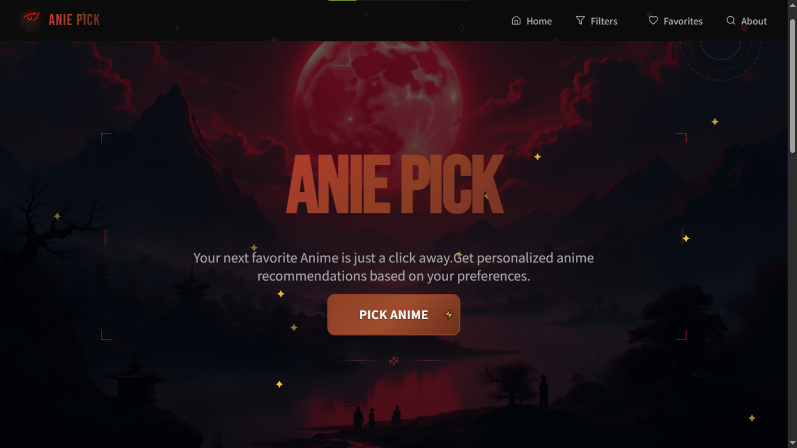

# 🍥 AniePick




<div align="center">

[](https://aniepick.netlify.app/)


</div>


AniePick is a red-and-black themed anime recommendation app powered by the **Jikan API** (MyAnimeList data).  
It helps you discover random anime series or movies, with filters for genre, year, and more — no endless searching required.

---

## 🌟 Features

- 🎯 **Random Anime Discovery** – Get a completely new anime suggestion every time you visit.
- 🎨 **Anime-Themed UI** – Red & black color palette with Japanese-inspired fonts.
- 📱 **Responsive Design** – Optimized for desktop, tablet, and mobile.
- 📄 **Detailed Info** – Title, synopsis, genres, episode count, score, and poster image.
- ❤️ **Favorites** – Save anime to your personal watchlist (local storage).
- 🔍 **Filtering** – Narrow results by genre, year, or type (TV, OVA, Movie, etc.).

---

## 🛠 Tech Stack

- **Frontend:** HTML, CSS, JavaScript (React or Vanilla)
- **API:** [Jikan API](https://jikan.moe/)
- **Hosting:** Netlify / Vercel
- **Fonts:** [Kaushan Script](https://fonts.google.com/specimen/Kaushan+Script) for the logo, [Poppins](https://fonts.google.com/specimen/Poppins) for UI text.

---

## 🔑 Setup Instructions

1. **Clone the repository**
   ```bash
   git clone https://github.com/yourusername/Aniepick.git
   cd Aniepick
   ````

2. **Install dependencies** (if using React)

   ```bash
   npm install
   ```

3. **No API key required**

   * AniePick uses the free **Jikan API**, so no signup is necessary.
   * API Base URL: `https://api.jikan.moe/v4/`

4. **Run the app locally**

   ```bash
   npm start
   ```

---

## 🚀 Deployment

Deploy easily to [Netlify](https://www.netlify.com/) or [Vercel](https://vercel.com/).

---

## 📜 License

This project is licensed under the MIT License.

---

## 💡 Acknowledgments

* **Jikan API** for anime data from MyAnimeList.
* **Google Fonts** for typography.
* **Brand Family** – AniePick is part of the “Pick” brand alongside CinePick and MeloPick.


```
